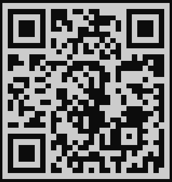
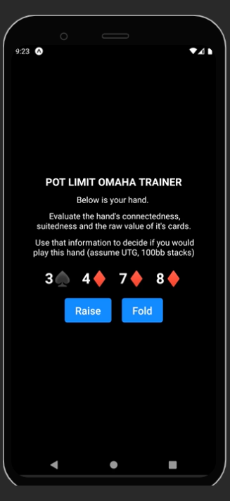

# Pot Limit Omaha Hand Selection Trainer

## Access

I used [this Expo Snack environment](https://snack.expo.dev/@tyler.bennett52/b01dfc) for development purposes. This is probably the best way to view the app as I intended for it to look.

To view this on your own device using Expo Go you can scan the following QR code.

## Problem Domain

In Texas Hold'em there are 1,326 possible combinations of hold cards (cards dealt to each player). It is common that players will try to memorize these hands and decide which ones to play pre-flop. Pot Limit Omaha has similar rules to Texas Hold'em with the key difference that you are dealt 4 cards instead of 2. This means there are 270,725 possible combinations. Good luck memorizing that.

The idea of this app is to allow players to drill themselves on which hands they should play and which ones they shouldn't by presenting them with a hand and having them choose Raise/Fold. Hopefully players will develop an intuitive sense for what is playable rather than trying to memorize a quarter million combinations.

## Design and Features

The app is very simple. Simply decide if you think the hand is playable or not. If it is playable choose Raise, if it is not choose Fold. You will be told if your answer is correct/incorrect and then if you want to play another hand you can hit the Next Hand button. This goes on forever.

To practice interacting with mobile device specific features I have made the phone vibrate when given a wrong answer. Hopefully this sort of Pavlovian feedback spurs along faster learning.

## Road Map

Hot Streak Indicator

Different Ranges for Less players (you can play worse hands if you are heads up, for example.)

Different Stack Sizes
